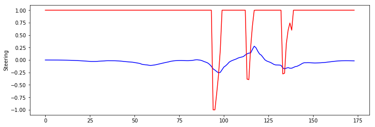

# CarND-Controls-MPC
Self-Driving Car Engineer Nanodegree Program


## Project Description
The purpose of this project is to develop a Model Predictive Controller (MPC) to steer a car around a track in a simulator. The simulator provides current state of the car - position, speed, heading direction and several closest waypoints of the path. As a result controller should return throotle and steering value.
### The Vehicle Model
The vehicle model used in this project is a kinematic bicycle model. It neglects all dynamical effects such as inertia, friction and torque. The model takes changes of heading direction into account and is thus non-linear. The model used consists of the following equations
```
  x(i+1) = x(i) + v(i) * cos(psi(i)) * dt
  y(i+1) = y(i) + v(i) * sin(psi(i)) * dt
  psi(i+1) = psi(i) - v(i)*delta(i)/Lf*dt
  v(i+1) = v(i) + a(i) * dt
  cte(i+1) = (f(i) - y(i)) + v(i)*sin(epsi(i))*dt
  epsi(i+1) = (psi(i) - psides(i)) + v(i) * delta(i)/Lf * dt
```
Here, `x,y` denote the position of the car, `psi` the heading direction, `v` its velocity `cte` the cross-track error and `epsi` the orientation error. `Lf` is the distance between the center of mass of the vehicle and the front wheels and affects the maneuverability. The vehicle model can be found in the class `FG_eval`. 

### Polynomial Fitting and MPC Preprocessing

The simulator sends its coordinates to the MPC controller in the global Map coordinates. These waypoints are converted into Vehicle's coordinates using a transform. This is implemented in `map2car` in `utils.hpp`. The transform essentially shifts the origin to the vehicle's current position, and then applies a 2D rotation to align x-axis to the heading of the vehicle. 
```
 X =   cos(psi) * (ptsx[i] - x) + sin(psi) * (ptsy[i] - y);
 Y =  -sin(psi) * (ptsx[i] - x) + cos(psi) * (ptsy[i] - y);  
```
where `X,Y` denote coordinates in the vehicle coordinate system. Note that the initial position of the car and heading direction are always zero in this frame. The state of the car in the vehicle cordinate system is 
```
          state << 0, 0, 0, v, cte, epsi, steer_angle, acceleration;
```
initially. 


### Model Predictive Control with Latency
In this project we also need to take into account latency which simulates that car does not actuate the commands instantly. In the code it is simulated by
```  
   this_thread::sleep_for(chrono::milliseconds((int)(latency * 1000)));
```  
But real latency is greater then 100 ms, because you should also take into account time you need to calculate actuators. For 20 steps it takes on my laptop 110 ms (average), for 10 steps 60 ms (average). So instead of taking into account only 100 ms lattency I take 100ms plus average time needed to solve optimization problem
When delays are not properly accounted for oscillations and/or bad trajectories can occur - for speed 100 mph and latency 200ms you car would travel 8 meters without control signal.

There are at least two common aproaches to solve the latency problems:
1. Constraining the controls to the values of the previous iteration for the duration of the latency. Thus the optimal trajectory is computed starting from the time after the latency period. 
I see big disadvantage in this method as you restricted in choosing step time to be some fraction of latency time 
2. Estimate new state of the car after latency time pass based on it's current state. 

I choose second method, the only problem was that current state of the car didn't contains acceleration value. On low latency for estimation could be used throttle value instead, but I decided to be more precise and calculate acceleration based on previous state and time difference between previous and current states
```
   acceleration = (v - v_prev)/dt;
``` 
Calculation of new state after latency
```
    x += v * real_latency;
    y = 0.0;
    psi += v * (-steer_angle) / Lf * real_latency;
    cte += v * sin(epsi) * latency;
    epsi += + v * (-steer_angle) / Lf * real_latency;
    v += acceleration * real_latency;
```

### Timestep Length and Elapsed Duration (N & dt)
The time `T=N dt` defines the prediction horizon. It shouldn't be too short or too long. If its too long it increases calculation time. Also if it's too short you would sharp turns which leads to instability and oscilations.
With `T=2s` and selected coefficients for cost function car trajectory have very smooth recovery of trajectory after turns.

For `dt` I think you should choose values close to interval you MPC controller have been called, in my case it's `200ms`. Choosing lower value
 will only increase calculating solution time and I don't think it gives you any advantage as you wouldn't bw able to use intermediate actuators values.
 
`N=10` which gives `T=2s`. In this case solving optimization task takes `60ms`.

### Cost Function Parameters
The cost of a trajectory of length N is computed as follows
```
        vector<double> weights = {0.1, 10.0, 0.1, 4500.0, 1.0, 10.0, 0.0};

        // The part of the cost based on the reference state.
        for (size_t t = 0; t < N; t++) {
            fg[0] += weights[0]*CppAD::pow(vars[cte_start + t], 2);
            fg[0] += weights[1]*CppAD::pow(vars[epsi_start + t], 2);
            fg[0] += weights[2]*CppAD::pow(vars[v_start + t] - ref_v, 2);
        }
        // Minimize the use of actuators.
        for (size_t t = 0; t < N - 1; t++) {
            fg[0] += weights[3]*CppAD::pow(vars[delta_start + t], 2);
            fg[0] += weights[4]*CppAD::pow(vars[a_start + t], 2);
        }
        // Minimize the value gap between sequential actuations.
        for (size_t t = 0; t < N - 2; t++) {
            fg[0] += weights[5]*CppAD::pow(vars[delta_start + t + 1] - vars[delta_start + t], 2);
            fg[0] += weights[6]*CppAD::pow(vars[a_start + t + 1] - vars[a_start + t], 2);
        }
```

Another part of cost function is using different reference speed depending on trajectory. If there are sharp turn at some distance ahead reference speed is decreased.

```
     double rx = 20;
     double radius = abs(pow(1 + pow(polyevalDer1(coeffs, rx), 2), 1.5)/ polyevalDer2(coeffs, rx));
     // If radius of the turn is less then 50m
     if(radius < 50){
         ref_v = ref_v_original / 1.5;
     }
```
This allows car to reach up to `107 mph` on straight part of the track and don't miss sharp turns because of centrifugal force. 

In the graph shown steering (blue) and (throttle) values accross one lap. We can see that steering is very smooth which helps to avoid any oscillations. 


###Final result
[](https://www.youtube.com/watch?v=Et-5Nxt2SPQ "Final video")


---

## Dependencies

* cmake >= 3.5
 * All OSes: [click here for installation instructions](https://cmake.org/install/)
* make >= 4.1
  * Linux: make is installed by default on most Linux distros
  * Mac: [install Xcode command line tools to get make](https://developer.apple.com/xcode/features/)
  * Windows: [Click here for installation instructions](http://gnuwin32.sourceforge.net/packages/make.htm)
* gcc/g++ >= 5.4
  * Linux: gcc / g++ is installed by default on most Linux distros
  * Mac: same deal as make - [install Xcode command line tools]((https://developer.apple.com/xcode/features/)
  * Windows: recommend using [MinGW](http://www.mingw.org/)
* [uWebSockets](https://github.com/uWebSockets/uWebSockets)
  * Run either `install-mac.sh` or `install-ubuntu.sh`.
  * If you install from source, checkout to commit `e94b6e1`, i.e.
    ```
    git clone https://github.com/uWebSockets/uWebSockets 
    cd uWebSockets
    git checkout e94b6e1
    ```
    Some function signatures have changed in v0.14.x. See [this PR](https://github.com/udacity/CarND-MPC-Project/pull/3) for more details.
* Fortran Compiler
  * Mac: `brew install gcc` (might not be required)
  * Linux: `sudo apt-get install gfortran`. Additionall you have also have to install gcc and g++, `sudo apt-get install gcc g++`. Look in [this Dockerfile](https://github.com/udacity/CarND-MPC-Quizzes/blob/master/Dockerfile) for more info.
* [Ipopt](https://projects.coin-or.org/Ipopt)
  * Mac: `brew install ipopt`
       +  Some Mac users have experienced the following error:
       ```
       Listening to port 4567
       Connected!!!
       mpc(4561,0x7ffff1eed3c0) malloc: *** error for object 0x7f911e007600: incorrect checksum for freed object
       - object was probably modified after being freed.
       *** set a breakpoint in malloc_error_break to debug
       ```
       This error has been resolved by updrading ipopt with
       ```brew upgrade ipopt --with-openblas```
       per this [forum post](https://discussions.udacity.com/t/incorrect-checksum-for-freed-object/313433/19).
  * Linux
    * You will need a version of Ipopt 3.12.1 or higher. The version available through `apt-get` is 3.11.x. If you can get that version to work great but if not there's a script `install_ipopt.sh` that will install Ipopt. You just need to download the source from the Ipopt [releases page](https://www.coin-or.org/download/source/Ipopt/) or the [Github releases](https://github.com/coin-or/Ipopt/releases) page.
    * Then call `install_ipopt.sh` with the source directory as the first argument, ex: `sudo bash install_ipopt.sh Ipopt-3.12.1`. 
  * Windows: TODO. If you can use the Linux subsystem and follow the Linux instructions.
* [CppAD](https://www.coin-or.org/CppAD/)
  * Mac: `brew install cppad`
  * Linux `sudo apt-get install cppad` or equivalent.
  * Windows: TODO. If you can use the Linux subsystem and follow the Linux instructions.
* [Eigen](http://eigen.tuxfamily.org/index.php?title=Main_Page). This is already part of the repo so you shouldn't have to worry about it.
* Simulator. You can download these from the [releases tab](https://github.com/udacity/self-driving-car-sim/releases).
* Not a dependency but read the [DATA.md](./DATA.md) for a description of the data sent back from the simulator.


## Basic Build Instructions


1. Clone this repo.
2. Make a build directory: `mkdir build && cd build`
3. Compile: `cmake .. && make`
4. Run it: `./mpc`.

## Tips

1. It's recommended to test the MPC on basic examples to see if your implementation behaves as desired. One possible example
is the vehicle starting offset of a straight line (reference). If the MPC implementation is correct, after some number of timesteps
(not too many) it should find and track the reference line.
2. The `lake_track_waypoints.csv` file has the waypoints of the lake track. You could use this to fit polynomials and points and see of how well your model tracks curve. NOTE: This file might be not completely in sync with the simulator so your solution should NOT depend on it.
3. For visualization this C++ [matplotlib wrapper](https://github.com/lava/matplotlib-cpp) could be helpful.

## Editor Settings

We've purposefully kept editor configuration files out of this repo in order to
keep it as simple and environment agnostic as possible. However, we recommend
using the following settings:

* indent using spaces
* set tab width to 2 spaces (keeps the matrices in source code aligned)

## Code Style

Please (do your best to) stick to [Google's C++ style guide](https://google.github.io/styleguide/cppguide.html).

## Project Instructions and Rubric

Note: regardless of the changes you make, your project must be buildable using
cmake and make!

More information is only accessible by people who are already enrolled in Term 2
of CarND. If you are enrolled, see [the project page](https://classroom.udacity.com/nanodegrees/nd013/parts/40f38239-66b6-46ec-ae68-03afd8a601c8/modules/f1820894-8322-4bb3-81aa-b26b3c6dcbaf/lessons/b1ff3be0-c904-438e-aad3-2b5379f0e0c3/concepts/1a2255a0-e23c-44cf-8d41-39b8a3c8264a)
for instructions and the project rubric.

## Hints!

* You don't have to follow this directory structure, but if you do, your work
  will span all of the .cpp files here. Keep an eye out for TODOs.

## Call for IDE Profiles Pull Requests

Help your fellow students!

We decided to create Makefiles with cmake to keep this project as platform
agnostic as possible. Similarly, we omitted IDE profiles in order to we ensure
that students don't feel pressured to use one IDE or another.

However! I'd love to help people get up and running with their IDEs of choice.
If you've created a profile for an IDE that you think other students would
appreciate, we'd love to have you add the requisite profile files and
instructions to ide_profiles/. For example if you wanted to add a VS Code
profile, you'd add:

* /ide_profiles/vscode/.vscode
* /ide_profiles/vscode/README.md

The README should explain what the profile does, how to take advantage of it,
and how to install it.

Frankly, I've never been involved in a project with multiple IDE profiles
before. I believe the best way to handle this would be to keep them out of the
repo root to avoid clutter. My expectation is that most profiles will include
instructions to copy files to a new location to get picked up by the IDE, but
that's just a guess.

One last note here: regardless of the IDE used, every submitted project must
still be compilable with cmake and make./
